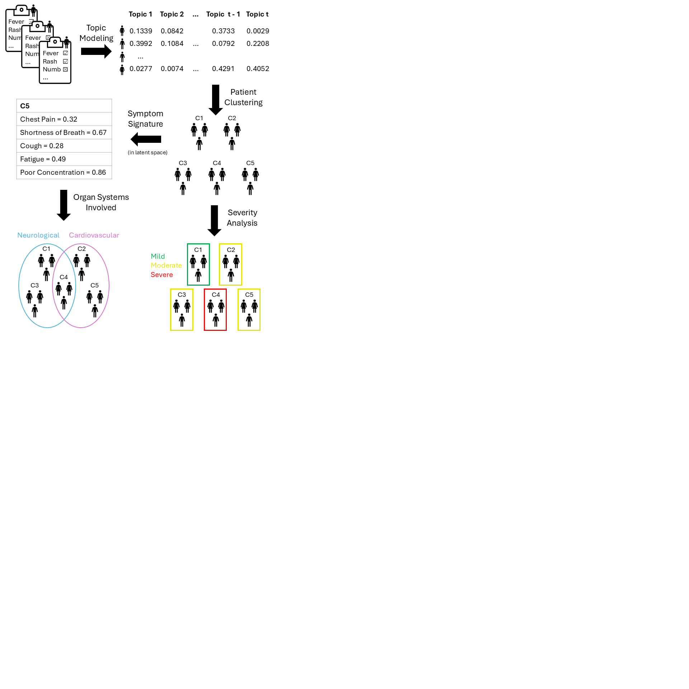

# Machine Learning Analysis of Clinical Questionnaires Identifies Clusters, Severity Groups, and Trajectories of Post-Acute COVID Symptoms

Preprint: Peng et al. 2025 [https://www.biorxiv.org/content/10.1101/2025.04.10.648034v1](https://www.biorxiv.org/content/10.1101/2025.04.10.648034v1).

## Steps to run analysis

### ETL each cohort's symptom surveys. 

`data_qc/data_qc_{cohort}.ipynb`

### Run topic modeling. 

code: Subphenotyping-for-PASC/Python code for training topic modeling/Main_train_topic_model.py

- code from: Zhang, H., Zang, C., Xu, Z. et al. Data-driven identification of post-acute SARS-CoV-2 infection subphenotypes. Nat Med 29, 226–235 (2023). https://doi.org/10.1038/s41591-022-02116-3

- [Github link](https://github.com/HaoZhangXidian/Subphenotyping-for-PASC)

### Calculate optimal number of topics.

code: get_num_topics.ipynb

### Calculate optimal clustering method and number of clusters.

code: get_n_clusters.ipynb

### Interpret topic modeling results.

code: {cohort}/results_*.ipynb

## Cohorts

UCSF (N = 669): University of California, San Francisco, CA, USA

ISMMS (N = 615): Icahn School of Medicine at Mount Sinai, New York, NY, USA

Emory (N = 60): Emory University, Atlanta, GA, USA
- combined with ISMSS leads to results in sinai_emory_n675

Cardiff (N = 317): University Hospital of Wales, Cardiff, UK
