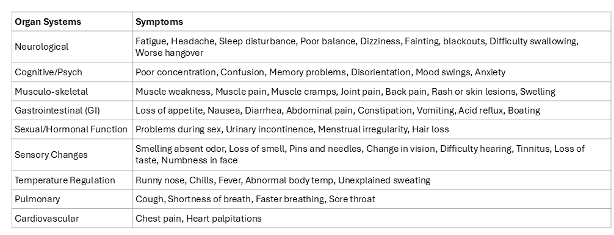

# Machine Learning Analysis of Clinical Questionnaires Identifies Clusters, Severity Groups, and Trajectories of Post-Acute COVID Symptoms

This Github repository provides the code and result files related to the following manuscript. 

Preprint: Peng et al. 2025 [https://www.biorxiv.org/content/10.1101/2025.04.10.648034v1](https://www.biorxiv.org/content/10.1101/2025.04.10.648034v1).

Supplementary Materials: https://github.com/BeverlyPeng/endotyping_covid/blob/main/Supplementary%20Materials.xlsx

| Folder Name | Description |
|----------|----------|
| cardiff_n317 | Cardiff cohort, n = 317: a case-control study of Long COVID | 
| sinai_emory_n675 | Sinai+Emory cohort, n = 675: combined Sinai and Emory (long COVID with MENSA assay data) 
| sinai_n615 | Sinai cohort, n = 615: walk-in clinic, preconditions provided | 
| ucsf_n222 | UCSF cohort subset, n = 222 | 
| ucsf_n669 | UCSF cohort, n = 669: longitudinal with balanced demographics | 

### Workflow


## Steps to run analysis

### Step 1: Processing each cohort's symptom surveys. 

`data_qc/data_qc_{cohort}.ipynb`

Ex. `data_qc/data_qc_ucsf.ipynb`

- This file includes reading in raw Excel files containing surveys and comorbidities, subsetting to wanted surveys, quality controlling, and generating basic plots. 

- See data dictionary mapping symptoms across cohorts and organ systems in Supplementary Materials.xlsx Table 1.



### Step 2: Run topic modeling. 

`Subphenotyping-for-PASC/Python code for training topic modeling/Main_train_topic_model.py`

- Original code from: Zhang, H., Zang, C., Xu, Z. et al. Data-driven identification of post-acute SARS-CoV-2 infection subphenotypes. Nat Med 29, 226–235 (2023). https://doi.org/10.1038/s41591-022-02116-3

- Changed input dataset.

- Iterated through 2-80 topics 10 times. 

### Step 3: Calculate optimal number of topics.

`get_num_topics.ipynb`

- This file includes calculating topic coherence and data likelihood and plotting to find the optimal number of topics. 

### Step 4: Calculate optimal clustering method and number of clusters.

`get_n_clusters.ipynb`

- This file includes testing combinations of cluster methods and number of clusters and choosing based on silhouette score. 

### Step 5: Interpret topic modeling results.

`{cohort}/results_{cohort}_*.ipynb`

Ex. ucsf_n669/results_ucsf_n669_22topics_15clusters_model.ipynb

- This file includes code for interpreting topic modeling results and generating plots for publication. 

- See results in Supplementary Materials.xlsx Tables 2-5 (including cluster assignment, severity group, top 6 signature symptoms, top 3 organ systems).

### Step 6: Run meta-analysis on all patients across 4 cohorts. 

`meta_analysis/results_meta.ipynb`

- This file includes code for loading each cohort's topic modeling results, combining for meta-analysis, and generating plots for publication. 

## Cohorts

UCSF (N = 669): University of California, San Francisco, CA, USA

ISMMS (N = 615): Icahn School of Medicine at Mount Sinai, New York, NY, USA

Emory (N = 60): Emory University, Atlanta, GA, USA

- combined with ISMSS leads to results in sinai_emory_n675

Cardiff (N = 317): University Hospital of Wales, Cardiff, UK

## Github Directory Organization

```bash
├── 📂Subphenotyping-for-PASC
│   ├── 📂Python code for trianing topic modeling
│   │   ├── 📂pydpm
│   │   ├── Main_train_topic_model.py
│   │   └── run.sh
├── 📂cardiff_n317
│   └── similar structure as ucsf_n669
├── 📂data_qc
├── 📂legends
├── 📂meta_analysis
├── 📂sinai_emory_n675
│   └── similar structure as ucsf_n669
├── 📂sinai_n615
│   └── similar structure as ucsf_n669
├── 📂ucsf_n222
│   └── similar structure as ucsf_n669
├── 📂ucsf_n669
│   ├── 📂comorb
│   │   ├── proportion_auto.svg
│   │   ├── proportion_cancer.svg
│   │   └── ...
│   ├── 📂individual
│   │   ├── individual_cluster1.svg
│   │   ├── individual_cluster2.svg
│   │   └── ...
│   ├── 📂median
│   │   ├── median_cluster1.svg
│   │   ├── median_cluster2.svg
│   │   └── ...
│   ├── cluster_assignments_ucsf_n669_22topics_15clusters.csv     // contains each patients' cluster, endotype, and severity group assignment, severity score, top symptoms, top organ systems, covariates, and symptoms
│   ├── cluster_by_symptom_col.png                                // cluster by symptom heatmap, normalized by column
│   ├── cluster_by_symptom_row.png                                // cluster by symptom heatmap, normalized by row
│   ├── clusters_minibatch_15.csv                                 // cluster assignments of each patient, clustering_method = minibatch, n_clusters = 15
│   ├── comorb_proportions_ucsf_n669.csv                          // comorbidity proportions for each cluster
│   ├── embedding.npy                                             // umap coordinates from topic proportions
│   ├── endotypes.png                                             // table of endotype to cluster mapping with top 3 organ systems
│   ├── eq5d_cluster.svg                                          // barplot comparing EQ-5D scores between first and last survey across clusters
│   ├── eq5d_endotype.svg                                         // barplot comparing EQ-5D scores between first and last survey across endotypes
│   ├── eq5d_severity_1st_2nd.svg                                 // barplot comparing EQ-5D scores between severity groups across first and last surveys 
│   ├── eq5d_severity_mild_mod_severe.svg                         // barplot comparing EQ-5D scores between first and last surveys across severity groups
│   ├── likelihood_avg_n669.svg                                   // plot of likelihood mean against number of topics (average of 10 runs) for ucsf_n669
│   ├── likelihood_individual_n286.svg                            // plot of likelihood mean against number of topics for ucsf_n286 subset
│   ├── likelihood_individual_n669.svg                            // plot of likelihood mean against number of topics for ucsf_n669
│   ├── pie_cluster_eq5d.svg                                      // pie chart showing cluster composition for non-recovered and recovered groups
│   ├── pie_endotype_eq5d.svg                                     // pie chart showing endotype composition for non-recovered and recovered groups
│   ├── proportion_sex.svg                                        // barplots of the sex proportion for each cluster
│   ├── raw_surveys_ucsf_n669.csv                                 // raw surveys for each patient
│   ├── results_ucsf_n669_22topics_15clusters_model.ipynb         // Jupyter Notebook for processing results and generating figures
│   ├── severity_curve.svg                                        // severity score per cluster
│   ├── survey_bins.svg                                           // histogram of when surveys where completed
│   ├── symptoms.png                                              // table of top 6 symptoms per cluster
│   ├── symptoms_over_time_decreasing.svg                         // plots showing how patients' symptoms change over time (symptoms decreasing with time)
│   ├── symptoms_over_time_increasing.svg                         // plots showing how patients' symptoms change over time (symptoms increasing with time)
│   ├── symptoms_over_time_mountain.svg                           // plots showing how patients' symptoms change over time (symptoms remaining stable with time)
│   ├── top3organs.csv                                            // table of top 3 organ systems per cluster
│   ├── top6symptoms.csv                                          // table of top 6 symptoms per cluster
│   ├── topic_coherence_avg_n669.svg                              // plot of topic coherence against number of topics (average of 10 runs) for ucsf_n669
│   ├── topic_coherence_individual_n286.svg                       // plot of topic coherence against number of topics for ucsf_n286 subset
│   ├── topic_coherence_individual_n669.svg                       // plot of topic coherence against number of topics for ucsf_n669
│   ├── UCSF_EQ5D_correlation_ML-severity.svg                     // plot of mean EQ-5D score against ML-predicted severity score
│   ├── umap.svg                                                  // umap of ucsf_n669, colored by minibatch 15 clusters
│   ├── umap_0to30.svg                                            // umap of ucsf_n669, subset to surveys within 0-30 days, colored by minibatch 15 clusters
│   ├── umap_31to90.svg                                           // umap of ucsf_n669, subset to surveys within 31-90 days, colored by minibatch 15 clusters
│   └── umap_90after.svg                                          // umap of ucsf_n669, subset to surveys after 90 days, colored by minibatch 15 clusters
├── LICENSE.txt
├── README.md
├── Supplementary Materials.xlsx
├── get_n_clusters.ipynb
├── get_num_topics.ipynb
├── organ_system_mapping.png
└── workflow.png
```

## License

This project is licensed under the [MIT License](LICENSE).

## Acknowledgments

- PolyBio Research Foundation (Balvi B43)
- Steven & Alexandra Cohen Foundation
- U.S. National Institues of Health (NIH) (K23AI157875, R01AI141003, 1R01NS136197, R01AI184931, P01AI168347, U01AI187057, P01AI125180-05S1, R01AI172254, P01AI078907, U01AI045969, U19AI109962, U54CA260563, T32HL116271, 5T32AI074492)
- NIH RECOVER (1OT2HL156812-01)
- UK National Institute for Health and Care Research (COV-LT2-0041)
- Intramural Research Program of the NIH
